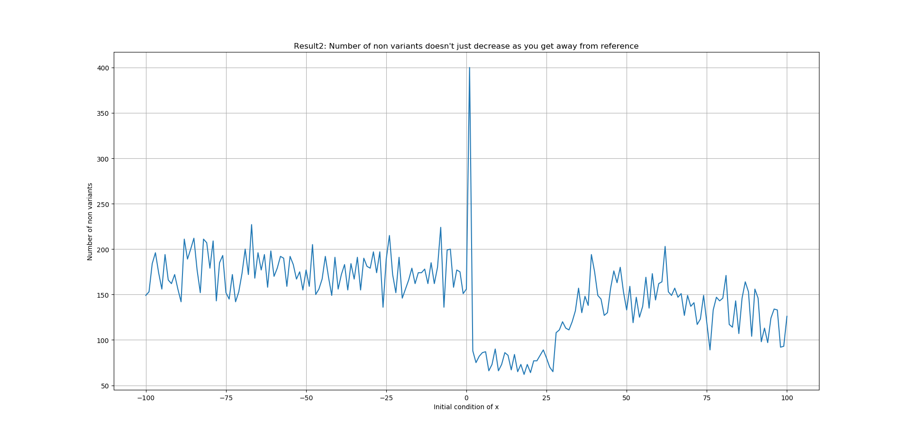

\tableofcontents
\newpage

#Introduction
Non linear dynamics is an essential field of study in both Physics and Mathematics. Many problems in this field don't have analytical solutions and require computational power. In this project, we first solve the computational problem of solving a set of 3 coupled first order differential equations and then use the result for an interesting application: Creating Musical variations.  

#Motivation
##Chaotic Attractors
Chaotic dynamics is a type of dynamics which is characterised by a sensitive dependance on initial conditions. That is, a small change in the initial conditions results in a very different trajectory in the state space. The trajectory of systems that follow such dynamics, in the state space, usually end up at a fixed point or a limit cycle. But some systems end up in 'Strange Attractors'. One such system is the Lorenz system of convection currents. The 'Strange Attractor' that this system eventually ends up in is called the 'Lorenz Attractor'.  It follows dynamics as dictated by the below set of 1st order differential equations [@strogatz2018, @dabby1996]:

\begin{align}
\dot x &= \sigma (y - x) \\
\dot y &= rx - y - xz \\
\dot z &= xy - bz \\
\end{align}
 
##Symbolic dynamics
Symbolic Dynamics is a technique of studying dynamics of a system. Here we chop up the dynamical trajectories of a system into discrete pieces and attach to each piece, a symbol. Now based on the sequences of the symbols created by the different trajetories we describe the dynamics of the system. [@wiki2018]

Herein arises the motivation for this project: **Use symbolic dynamics on Chaotic Attractors**. Here, we have used pitches from a musical piece as our symbols. But note that any context dependent sequence of data can be used.  Further we have used the Lorenz attractor, though any other 'Strange Attractor' can also be used. We use the chaotic attractor to create musical variations on a given musical piece. 

#Implementation details
##Obtaining the Lorenz attractor
To obtain the Lorenz attractor, we solve the aforementioned set of equations using the 4th order Runge Kutta solver [@newman2013]. We use a step size of 0.01 for 5000 steps. We used the parameter values: $r$ = 28, $\sigma$ = 10 and $b$ = 8/3 and give the requisite initial condition. The attractor obtained with initial condition $x = 1.0$, $y=1.0$, $z=1.0$ is shown in Figure \ref{fig1}:

##The symbols
Now that we have the attractor, we need the symbols. As mentioned before, we use the pitch sequence of a musical piece. In this project, we used J. S. Bach’s Prelude in C Major from The Well-Tempered Clavier, Book I as a musical piece.  Its sheet music is available in the public domain(See 8.1). It contains 34 measures/bars and two parts. One part is in the Treble Clef and the other is in the Bass Clef. We use the Treble Cleff part alone to make the analysis simpler. This part is shown below in Figure \ref{fig2}. It has only 33 measures since we have also ignored the final chord for simplicity, again.
 

##Creating the variation
Now, we create the reference trajectory. This is the trajectory to which the original piece(in Figure 2) is mapped to. It is generated with initial condition $x = 1.0$, $y=1.0$, $z=1.0$. Then we create a new trajectory with initial condition $x = 0.999$, $y=1.0$, $z=1.0$ with all the other parameters kept the same as before. (We only change $x$ because we only have one sequence of symbols. If we want to we can manipulate three sequences of symbols simultaneously, since we have $x$, $y$ and $z$. These other sequences could turn out to be volume levels at different notes, duration of each note etc..) To this new trajectory we map the pitches and call it the variation's trajectory. But this maping is done, based on a *rule*. Call the points of the reference trajectory $x_i$ where $i$ refers to the $i^{th}$ point in the trajectory. Then, call the points of the new trajectory $x_j'$ where $j$ refers to the $j^{th}$ point in the trajectory. Now let pitch $p_i$ be associated with the $i^{th}$ point of the reference trajectory. Then the *rule* for mapping pitches to the new trajectory is:
$$f(x_j') = p_{g(j)}$$ 
where $g(j)$ represents the index of the smallest $x_i$ for which $x_i \ge x_j'$. Note that in [music21](http://web.mit.edu/music21/), a Python package used for manipulation of music objects in this project, shuffling a (Python) list of pitches(notes) doesn't change the sequence of pitches in the stream object. Instead one has to change the offset of the pitches i.e the position of the notes from the beginning of the stream object, to change the sequence. So, in the Python script, instead of applying the above rule to pitches directly, we apply it to the offsets of the pitches. Nevertheless, the result is the same and it is as shown below in Figure \ref{fig3}. 

 

#Results
##The variant has the essence of the original piece
When we plot the pitch frequency against the index of the pitches (i.e. first pitch, second pitch and so on) of the reference trajectory and the variation's trajectory as shown below in Figure \ref{fig4}, we see that at many indices the frequencies match(for instances, see between 50-60 and in the neighbourhood of 100, the blue and red plots overlap). This is the reason why when we hear the variation, it sounds similar to the original. This phenomenon is caused by the aforementioned rule for mapping which ends up keeping track of the original. Another reason is that although shuffled up, we hear the same pitches in both the pieces. 

##Number of non variants doesn't just decrease as we get away from the reference trajectory
The next logical question would be, at how many indices do the frequencies match? Is there a pattern to this number? Let us call the pitches corresponding to the indices where the frequencies match as non variants. Now, one would expect that the number of non variants would keep decreasing as we move away from the reference trajectory. But this is only true superficially. This is clear from a plot of the number of non variants vs initial condition(on $x$) as shown in Figure \ref{fig5}. Although the number of non variants clearly decreases as we move away from the inital condition of the reference trajectory(which was $x = 1.0$, $y=1.0$, $z=1.0$ as mentioned before) it doesn't decrease as much for initial conditions lesser than $x = 1.0$ as it does for conditions greater than $x = 1.0$. Further, as we keep moving away the slope of the curve both increases and decreases! This is an artifact of the way the rule for mapping works and also the way in which trajectories are generated as we change the initial conditions. 

#Scope for further research
Both the results shown above (atleast partly) have been attributed to the nature of the mapping rule. Further work needs to be carried out to study exactly how much the rule matters. Also further analysis can be carried out by using different attractors, different step sizes, different mapping rules etc.. Also note that instead of using a pitch sequence, a different set of symbols can be used. A good example would be a nucleotide sequence[@dabby1996]. In this case one would get a genetic mutation instead of a musical variation. This would be especially appropriate because of the points made in 4.1. This is because in a mutated gene certain spots called mutation hotspots [@rogozin2003] are more prone to change than others, just like in Figure \ref{fig4}, where certain spots have changed while others haven't.

#Conclusion
Thus symbolic dynamics was used on the Lorenz attractor and a musical variation was created. It was found that the variation sounds similar to the original piece and that the number of non variants follows a complicated pattern. Though not explicitly shown, it was discussed that the rule for mapping plays a crucial role in both the effects. Some routes for further analysis was also laid out.

#Acknowledgements
This project was done in National Institute of Technology Karnataka as part of the course, coded PH 881 and titled 'Computational Physics' during Odd Semester(3rd semester) of academic year 2018-19. It was submitted to course instructor, Dr. T.K. Shajahan, Assistant Professor, Department of Physics.

#Supplementary Materials
Links to files lead to my personal GitHub repository.

##Sheet music
All the three files require [MuseScore](https://musescore.org) software to be opened.

1. The original sheet music file of  J. S. Bach’s Prelude in C Major from The Well-Tempered Clavier, Book I was downloaded as a MusicXML file from the [MuseScore website](https://musescore.com/user/101554/scores/117279). It can also be downloaded from here: [bwv846.mxl](https://github.com/VenkiPhy6/music_project/blob/master/Code/bwv846.mxl)
2. The sheet music for Figure 2 can be found in: [original.mscz](https://github.com/VenkiPhy6/music_project/blob/master/report/files/original.mscz)
3. The sheet music for Figure 3 can be found in: [variation1.mscz](https://github.com/VenkiPhy6/music_project/blob/master/report/files/variation1.mscz)

##Code
All the figures were generated by the code found in this Python script: [Final_code.py](https://github.com/VenkiPhy6/music_project/blob/master/Code/Final_code.py). One needs the packages [music21](http://web.mit.edu/music21/), [numpy](https://www.numpy.org/) and [matplotlib](https://matplotlib.org/) (and also MuseScore software to see Sheet Music) along with the first file mentioned in 8.1(renamed as 'bwv846.mxl') to fully run the script without errors. Read the docstrings found in between the script for more information.

##Audio files
The audio corresponding to sheet music in Figure 2 is found in: [original.mp3](https://github.com/VenkiPhy6/music_project/blob/master/report/files/original.mp3) and the audio corresponding to sheet music in Figure 3 in: [variation1.mp3](https://github.com/VenkiPhy6/music_project/blob/master/report/files/variation1.mp3). 

##Figures
Each entry leads to a link in my GitHub repository.

1. [Figure 1](https://github.com/VenkiPhy6/music_project/blob/master/report/files/lorenz.png)
2. [Figure 2](https://github.com/VenkiPhy6/music_project/blob/master/report/files/original.png)
3. [Figure 3](https://github.com/VenkiPhy6/music_project/blob/master/report/files/variation1.png)
4. [Figure 4](https://github.com/VenkiPhy6/music_project/blob/master/report/files/result1.png)
5. [Figure 5](https://github.com/VenkiPhy6/music_project/blob/master/report/files/result2.png)

#References
